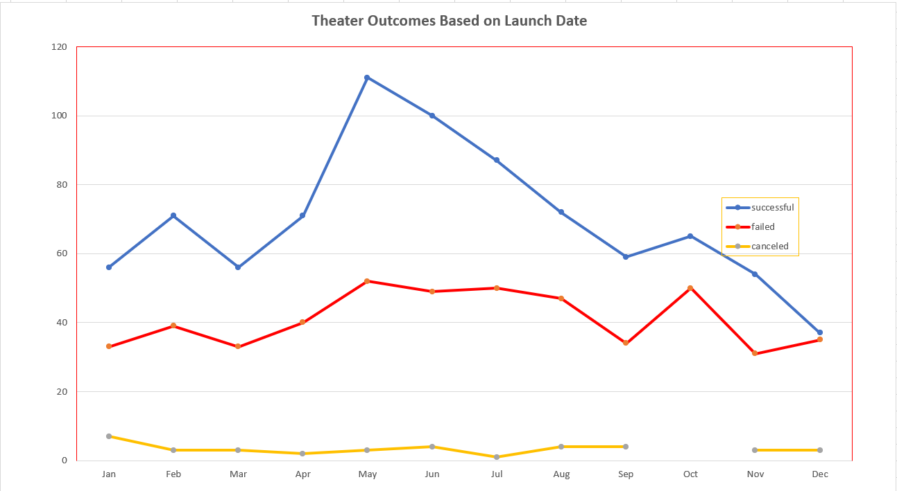
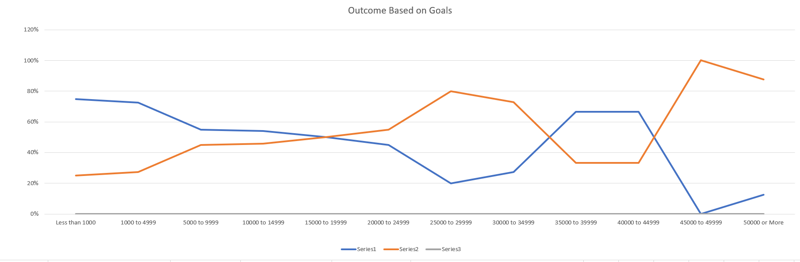
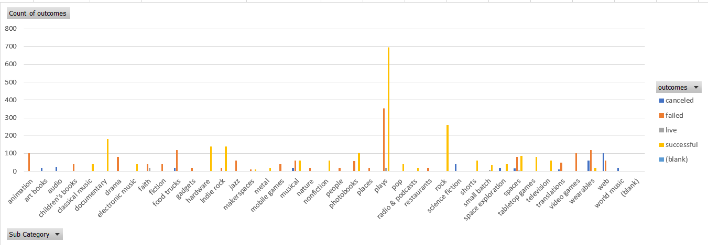

# Kickstarter-Analysis

## Overview of Project
Conducitng data analysis on crowdfunding projects to understand any hidden trends for Louise.

## Purpose
Helping Louise compare her play "FEVER", with regards to how well and when she can do her funding campaign by analysing the crowdfunding of different theatre campaign.

## Analysis and Challenges

### Analysis of Outcomes Based on Launch Date
The outcome based on launch date provided me the below visual, I analyzed for Louise the successfull crowdfunding campaigns and grouped them according to the months.
A graphical representation gives a breakdown of what campaings have been suceesful over the months for the theatre group category by their launch dates. 

The follwing steps where done to get to the above analysis
* Created a pivot table from the Kickstarter data.
* Filter the Parent Category to theatre.
*  Set the years in the columns section and filter to months. 
*  Filter the columns table to show count of successful,failed and cancelled.

###  Outcome Based on Goals
Using the table for the goal amount provided, I grouped the projects according to the goal amount and found the relevant data for successful, failed and cancelled projects. The following steps were done to get to this
 *  First create a columns for the goal ranges.
 *  Do a countifs based on the conditions mentioned to populate the following columns "Number Successful," "Number Failed," and "Number Canceled" based on the goal condition and then find their respective percentages.
 *  Then created a line cart to visualiaze the data for the relationship between the goal amount ranges and the percentage of successful,cancelled and failed.
 
 
### Challenges and Difficulties Encountered 
* Getting the unix time stamp converted to a date that is readable in excel.
* Getting the formula for the "Outcome based on Goals", I made the mistake of not including both sides of the condidtions. Eg, the condition 1000 to 4999 I only included    <=4999 and not >=1000, which threw my numbers off. 

# Results
## What are two conclusions you can draw about the Outcomes based on Launch Date?
* Theatre is the most sussesful category.
* May-July is the best time to launch for Louise.

## What can you conclude about the Outcomes based on Goals?
* Most successful were goals less that a 1000 to 4999, anything above 44999 the success rate drops significantly.

## What are some limitations of this dataset?
*  Different currencies are used, there is no conversion step to make them all similar in value.
*  No details on cost of crowdfunding campaigns.

##  What are some other possible tables and/or graphs that we could create?
### Outcome by Category

